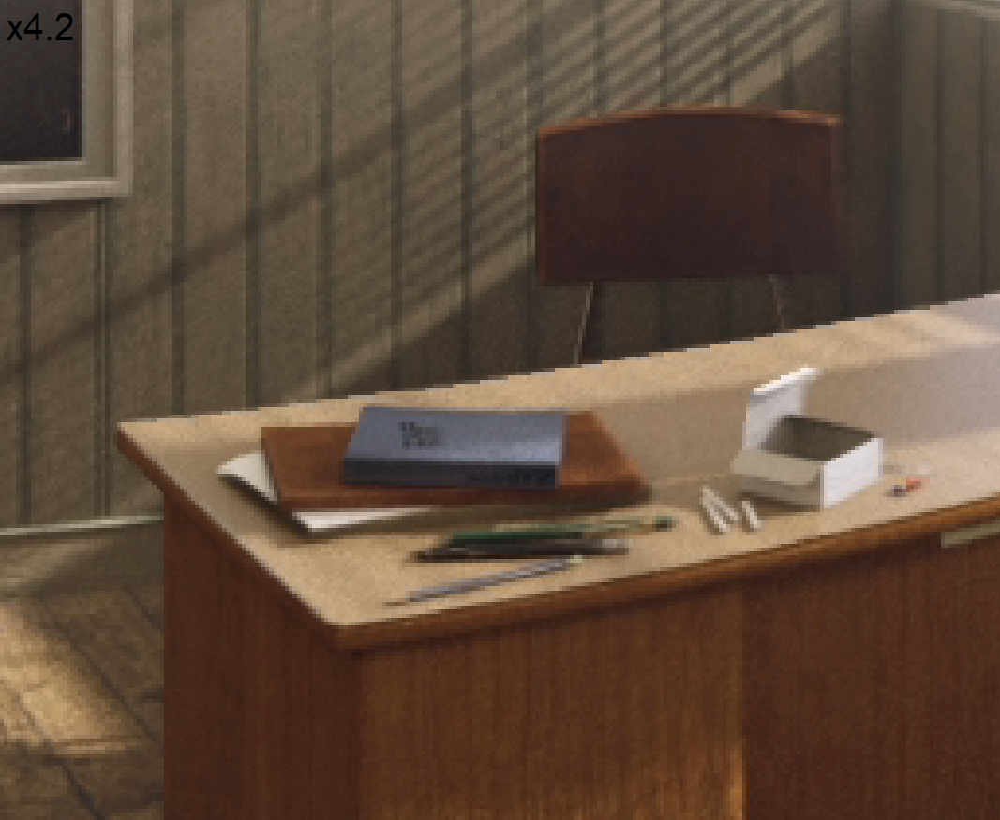

# RVS-CUDA

## Description

This new version of «RVS - Reference View Synthesizer»[^1] was developed as part of my final year project in Information Technology Engineering. By leveraging techniques based on asynchronism and kernel programming (via CUDA), this new iteration is approximately 100 times faster than RVS 4.0 on the «ClassroomVideo»[^3] sequence.

The main objective of this software is to generate synthesized views enabling 6DoF navigation within a virtual environment. The principle is as follows. Starting from real 360° footage captured by cameras arranged in an orderly manner, the challenge is to simulate, using interpolation techniques, any perspective of a virtual camera that can move freely within the entire space.

## Table of contents

- [Example of view synthesis using RVS on «ClassroomVideo»](#example-of-view-synthesis-using-rvs-on-classroomvideo)
- [Quality and performance](#quality-and-performance)
  - [Comparison of time for producing a «Perspective» type image](#comparison-of-time-for-producing-a-perspective-type-image)
  - [Quality of different implementations on «ClassroomVideo»](#quality-of-different-implementations-on-classroomvideo)
  - [Quality of different implementations on «Museum»](#quality-of-different-implementations-on-museum)
  - [Quality of different implementations on «Chess»](#quality-of-different-implementations-on-chess)
- [Usage](#usage)[^2]
  - [How to build RVS-CUDA](#how-to-build-rvs-cuda)
    - [Dependencies](#dependencies)
    - [CUDA architectures and corresponding compute capabilities](#cuda-architectures-and-corresponding-compute-capabilities)
    - [Suggested project organization](#suggested-project-organization)
  - [How to run RVS-CUDA](#how-to-run-rvs-cuda)
    - [Formatting the command line](#formatting-the-command-line)
    - [View synthesis JSON parameters](#view-synthesis-json-parameters)
    - [Camera JSON parameters](#camera-json-parameters)
    - [Differences from the initial version](#differences-from-the-initial-version)
- [Author of RVS-CUDA](#author-of-rvs-cuda)
- [Authors of the initial RVS software](#authors-of-the-initial-rvs-software)
- [License of the initial RVS software](#license-of-the-initial-rvs-software)

## Example of view synthesis using RVS on «ClassroomVideo»

| Ground Truth | OpenGL |
|--------------|--------|
|  |  |
| OpenCV | CUDA |
|  |  |

## Quality and performance

Tested on RTX A4500.

### Comparison of time for producing a «Perspective» type image

| Sequence         | Input Views | CPU (ms) | OpenGL (ms) | CUDA (ms) | Speedup (CPU / CUDA) |
|------------------|-------------|----------|-------------|-----------|---------------------|
| ClassroomVideo  | 4           | 12870    | 1524        | **130.1** | 98.92               |
| Museum           | 11          | 28252    | 2926        | **509.0** | 55.50               |
| Chess            | 4           | 8034     | 1062        | **110.0** | 73.04               |

### Quality of different implementations on «ClassroomVideo»

| Implementation    | WS-PSNR[^4] (dB)                          | IV-PSNR[^5] (dB) | SSIM[^6]                           |
|-------------------|--------------------------------------|-------------|---------------------------------------|
| **CPU**   | Y: 33.61, U: 49.57, V: 52.21         | 44.16       | Y: 0.8287, U: 0.9913, V: 0.9947       |
| **OpenGL**| Y: 33.46, U: 49.12, V: 51.79         | 43.57       | Y: 0.8270, U: 0.9906, V: 0.9943       |
| **CUDA**  | Y: 33.43, U: 50.41, V: 52.79         | 44.51       | Y: 0.8243, U: 0.9929, V: 0.9954       |

### Quality of different implementations on «Museum»

| Implementation    | WS-PSNR (dB)                          | IV-PSNR (dB) | SSIM                                  |
|-------------------|--------------------------------------|-------------|---------------------------------------|
| **CPU**   | Y: 30.30, U: 38.84, V: 40.06         | 37.74       | Y: 0.9131, U: 0.9257, V: 0.9439       |
| **OpenGL**| Y: 29.42, U: 38.65, V: 39.87         | 36.36       | Y: 0.8989, U: 0.9250, V: 0.9434       |
| **CUDA**  | Y: 30.09, U: 38.04, V: 39.19         | 37.71       | Y: 0.9085, U: 0.9124, V: 0.9333       |

### Quality of different implementations on «Chess»

| Implementation    | WS-PSNR (dB)                          | IV-PSNR (dB) | SSIM                                  |
|-------------------|--------------------------------------|-------------|---------------------------------------|
| **CPU**   | Y: 23.58, U: 43.41, V: 46.91         | 32.04       | Y: 0.9251, U: 0.9889, V: 0.9947       |
| **OpenGL**| Y: 22.28, U: 41.56, V: 45.43         | 30.54       | Y: 0.9012, U: 0.9845, V: 0.9926       |
| **CUDA**  | Y: 23.28, U: 43.22, V: 46.98         | 31.76       | Y: 0.9240, U: 0.9882, V: 0.9944       |

## Usage

### How to build RVS-CUDA

#### Dependencies

Build with CMake (file: ```/CMakeLists.txt```).
* [OpenCV (tested on v4.9.0)](https://github.com/opencv/opencv)
* [fmt (tested on v10.0.0)](https://github.com/fmtlib/fmt)
* [glm (tested on v1.0.0)](https://github.com/g-truc/glm)
* [Catch2 (tested on v3.5.2)](https://github.com/catchorg/Catch2)
* [CUDA (tested on v12.4)](https://developer.nvidia.com/cuda-12-4-0-download-archive)

#### CUDA architectures and corresponding compute capabilities

Adjust the value of ```CMAKE_CUDA_ARCHITECTURES``` in the ```/CMakeLists.txt``` file according to your NVIDIA GPU architecture[^9].

| Compute Capability | Architecture       | Example GPUs                          |
|--------------------|-------------------|---------------------------------------|
| **30**             | Kepler            | GTX 780, Tesla K20                    |
| **32**             | Kepler            | Tegra K1                              |
| **35**             | Kepler            | Tesla K40, GTX 770                    |
| **37**             | Kepler            | Tesla K80                             |
| **50**             | Maxwell           | GTX 750, GTX 750 Ti                   |
| **52**             | Maxwell           | GTX 970, GTX 980                      |
| **53**             | Maxwell           | Tegra X1                              |
| **60**             | Pascal            | GTX 1080, GTX 1070                    |
| **61**             | Pascal            | GTX 1050, GTX 1060                    |
| **62**             | Pascal            | Jetson TX2                            |
| **70**             | Volta             | Tesla V100                            |
| **72**             | Volta             | Xavier AGX, Jetson AGX                |
| **75**             | Turing            | RTX 2060, RTX 2070, RTX 2080, GTX 1660|
| **80**             | Ampere            | A100, RTX 3090, RTX 3080              |
| **86**             | Ampere            | RTX 3060, RTX 3070, RTX 3080 Ti       |
| **89**             | Ada Lovelace      | RTX 4090, RTX 4080                    |
| **90**             | Hopper            | H100, Hopper GPUs                     |

#### Suggested project organization

```
.
├── Build/
│   └── Release/
│       └── RVS.exe
├── Config/
│   ├── RVS-A01.json
│   ├── A01.json
│   └── PoseTrace.csv
├── Content/
│   └── A01/
│       └── *.yuv
├── Experiment/
│   └── A01/
│       └── *.yuv
├── rvs/
│   └── src/
└── rvs_cuda_lib/
    └── src/
```

* ```Content``` folder = Input files
* ```Experiment``` folder = Output files


### How to run RVS-CUDA

#### Formatting the command line

```bash
cd RVS-CUDA/Build/
./Release/RVS.exe "../Config/RVS-{Sequence}.json" [--cuda | --opengl]
```

| Cmd | Description |
|:----|:------------|
|     | json file path |
|     | default version: CPU |
| --cuda | using CUDA speedup |
| --opengl | using OpenGL speedup |

#### View Synthesis Json parameters

| Name                     | Value       | Description |
|:-------------------------|:------------|:------------|
|Version                   | string      | version number |
|InputCameraParameterFile  | string      | filepath to input cameras json |
|VirtualCameraParameterFile| string      | filepath to input cameras json |
|VirtualPoseTraceName      | string      | filepath to posetraces (optional) |
|InputCameraNames          | string list | list of input cameras  |
|VirtualCameraNames        | string list | list of output cameras |
|ViewImageNames            | string list | filepaths to input images |
|DepthMapNames             | string list | filepaths to input depth |
|OutputFiles               | string list | filepaths to output images |
|StartFrame                | int         | first frame (starts at 0) |
|NumberOfFrames            | int         | number of frames in the input |
|Precision                 | float       | precision level |
|ColorSpace                | string      | YUV working colorspace |
|ViewSynthesisMethod       | string      | Triangles |
|BlendingMethod            | string      | Simple |
|BlendingFactor            | float       | factor in the blending |

#### Camera Json parameters

| Name         | Value         | Description |
|:-------------|:--------------|:------------|
|Name		   | string		   | camera name |
|Position      | float 3  	   | position (front,left,up) |
|Rotation      | float 3       | rotation (yaw,pitch,roll) |
|Depthmap      | int           | has a depth |
|Depth_range   | float 2       | min and max depth |
|DisplacementMethod| string    | Depth |
|Resolution    | int 2    	   | resolution (pixel) |
|Projection    | string        | perspective or equirectangular |
|Focal         | float 2       | focal (pixel) |
|Principle_point| float 2      | principle point (pixel) |
|BitDepthColor | int           | color bit depth |
|BitDepthDepth | int           | depth map bit depth |
|ColorSpace    | string        | YUV420 |
|DepthColorSpace| string       | YUV420 |

#### Differences from the initial version

* Only works for images in YUV420 format.
* The blending factor is always greater than or equal to 1.
* The blending method is always set to «Simple».
* The input files have an «Equirectangular» projection type.
* The output files are YUV texture files.

## Author of RVS-CUDA

Enzo Di Maria, Double Master's Student:
* École de Technologie Supérieure, Montréal, Canada[^7]
* ENSEEIHT, Toulouse, France[^8]

[^1]: MPEG-I Visual, RVS, https://gitlab.com/mpeg-i-visual/rvs
[^2]: S. Fachada, B. Kroon, D. Bonatto, B. Sonneveldt, G. Lafruit, Reference View Synthesizer (RVS) 2.0 manual, [N17759], Ljubljana, Slovenia
[^3]: MPEG-I Visual, Content Database, https://mpeg-miv.org/index.php/content-database-2/
[^4]: Sun, Y., Lu, A., & Yu, L. (2017). Weighted-to-Spherically-Uniform Quality Evaluation for Omnidirectional Video. IEEE Signal Processing Letters, 24(9), 1-1. https://doi.org/10.1109/LSP.2017.2720693.
[^5]: Dziembowski, A., Mieloch, D., Stankowski, J., & Grzelka, A. (2022). IV-PSNR—The Objective Quality Metric for Immersive Video Applications. IEEE Transactions on Circuits and Systems for Video Technology, 32(11), 7575–7591. https://doi.org/10.1109/TCSVT.2022.3179575.
[^6]: Wang, Z., Bovik, A. C., Sheikh, H. R., & Simoncelli, E. P. (2004). Image Quality Assessment: From Error Visibility to Structural Similarity. IEEE Transactions on Image Processing, 13(4), 600–612. https://doi.org/10.1109/TIP.2003.819861.
[^7]: ÉTS, https://www.etsmtl.ca
[^8]: ENSEEIHT, https://www.enseeiht.fr/fr/index.html
[^9]: CUDA GPUs, Your GPU Compute Capability, https://developer.nvidia.com/cuda-gpus

## Authors of the initial RVS software

* Sarah Fachada, Universite Libre de Bruxelles, Bruxelles, Belgium
* Daniele Bonatto, Universite Libre de Bruxelles, Bruxelles, Belgium
* Arnaud Schenkel, Universite Libre de Bruxelles, Bruxelles, Belgium
* Bart Kroon, Koninklijke Philips N.V., Eindhoven, The Netherlands
* Bart Sonneveldt, Koninklijke Philips N.V., Eindhoven, The Netherlands